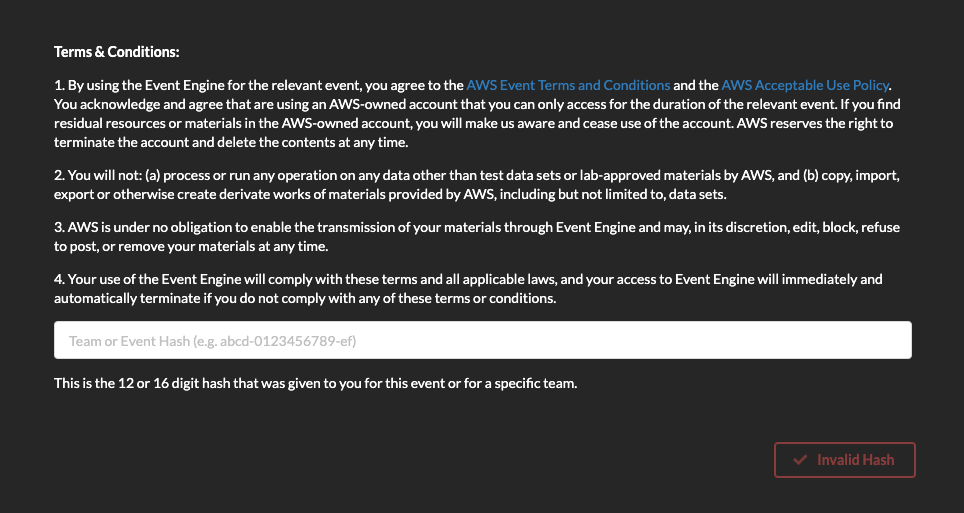
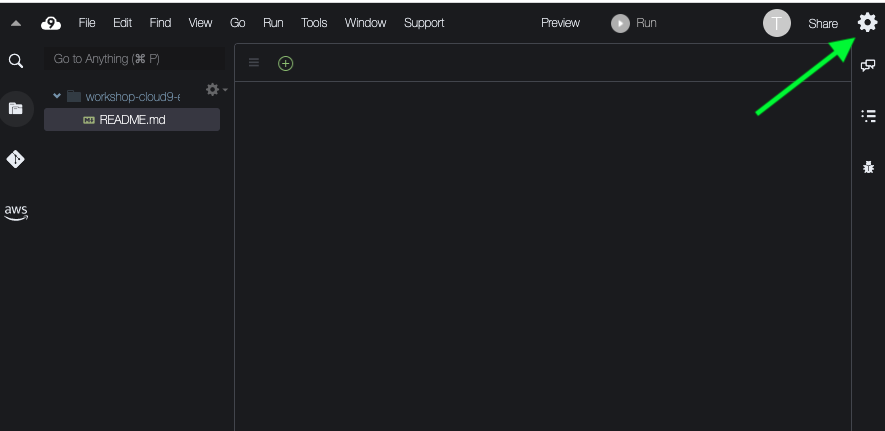
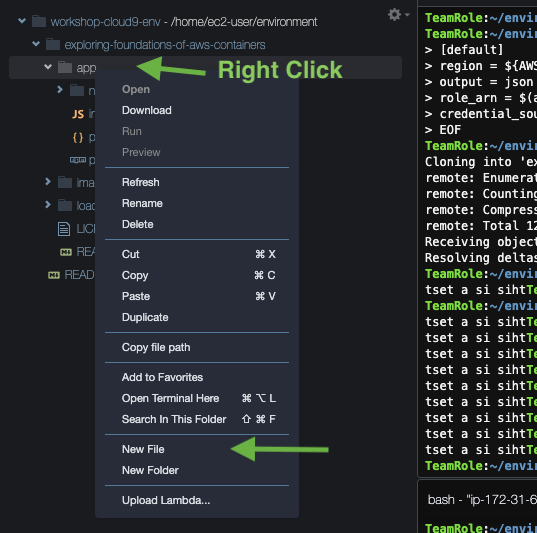

# Deploying a container to AWS Fargate using AWS Copilot

## Step One: Access your account

Open up the AWS Event Engine portal: [https://dashboard.eventengine.run/](https://dashboard.eventengine.run/)



You need to enter the hash that you were provided. This will open up the
Event Engine dashboard:


Click on the "AWS Console" button.


Then click on "Open AWS Console".

You will be logged in to the AWS Console of a temporary AWS account that you
can use for the duration of this workshop:


In the search bar at the top type "Cloud9" and click on the "Cloud9" service
when it appears. This will open up the service console for accessing
a cloud development environment. You will see a preprepared development
environment that you can use:


Click on the "Open IDE" button to access your development environment. You may see an
interstitial screen similar to this one for a minute or two:


Once the development environment opens up click on the settings button in the upper right corner:



Then select "AWS Settings" and ensure that the "AWS managed temporary credentials" settings is off (red).


This workshop will be using an automatically created IAM role that is attached to the Cloud9 development
environment, rather than the default Cloud9 temporary credentials.

Now the development environment is ready to go, so we just need to open up a terminal to run commands in.

<details>
  <summary>Press the green plus button and select "New Terminal":</summary>

  
</details>

In the terminal you can now run the command to install the latest version of AWS Copilot, and verify that it runs:

```sh
curl -Lo copilot https://github.com/aws/copilot-cli/releases/latest/download/copilot-linux
chmod +x copilot
sudo mv copilot /usr/local/bin/copilot
copilot --help
```

Next let's run a quick script to customize the AWS config inside of the development environment:

```sh
# Install prerequisites
sudo yum install -y jq

# Setting environment variables required to communicate with AWS API's via the cli tools
echo "export AWS_DEFAULT_REGION=$(curl -s 169.254.169.254/latest/dynamic/instance-identity/document | jq -r .region)" >> ~/.bashrc
source ~/.bashrc

mkdir -p ~/.aws

cat << EOF > ~/.aws/config
[default]
region = ${AWS_DEFAULT_REGION}
output = json
credential_source = Ec2InstanceMetadata
EOF
```

Last you should clone this repo inside of the environment in order to pull in the code that will be used:

```sh
git clone https://github.com/nathanpeck/deploying-container-to-fargate-using-aws-copilot.git
```

## Step Two: Meet the sample application

In the Cloud9 IDE look at the sidebar and open the file at `/deploying-container-to-fargate-using-aws-copilot/app/index.js`:


This file is the main application code for the sample application that will be deployed. It is a basic Node.js Express microservice that just accepts arbitrary string payloads, and then reverses and returns them.

You can run this microservice locally on the Cloud9 environment even though it is not yet containerized.

Go back to the terminal that you opened in Cloud9 and run:

```sh
cd deploying-container-to-fargate-using-aws-copilot/app
npm install
node index.js
```

Open a new terminal the same way that you did before and run the following command a few times to send some strings to reverse:

```sh
curl -d "this is a test" localhost:3000
```

If you go back to the other terminal tab where you launched the application you can see logs from the running application.


Press Control + C in that tab to send a quit signal to the application and close it.

## Step Three: Create a Dockerfile for the application

Now that you have seen the application running, it is time to package this application up into a container image that can be run on AWS Fargate.

<details>
  <summary>Create a new file called `Dockerfile` inside of the `app` folder.</summary>

  
</details>

Copy and paste the following content into the Dockerfile:

```Dockerfile
FROM node:16 AS build
WORKDIR /srv
ADD package.json package-lock.json ./
RUN npm install

FROM node:16-slim
WORKDIR /srv
COPY --from=build /srv .
ADD . .
EXPOSE 3000
CMD ["node", "index.js"]
```

This file defines how to construct a Docker container image for the application. It uses a multistage build. The first stage is run inside a full Node.js development environment that has NPM, and the full package build dependencies, including a compiler for native bindings. The second stage uses a slim Node.js environment that just has the Node runtime. It grabs the prebuilt packages from the previous stage, and it adds the application code.

You can verify that this Dockerfile builds by running:

```sh
docker build -t app .
```

## Step Four: Run the application locally on the Cloud9 Instance

Now that the Docker container image is built, you can run the container image on the development instance to verify that it will work:

```sh
docker run -d -p 3000:3000 --name reverse app
```

This command has a few components to recognize:

- `docker run` - What you want to happen: run a container image as a container
- `-d` - Run the container in the background
- `-p 3000:3000` - The application in the container is binding to port 3000. Accept traffic on the host at port 3000 and send that traffic to the contianer's port 3000.
- `--name reverse` - Name this copy of the running container `reverse`
- `app` - The name of the container image to run as a container

You can now check to verify that the container is running:

```sh
docker ps
```


Last but not least you can send traffic to the containerized application in the same way that you sent traffic when it was running directly on the host:

```sh
curl -d "this is a test" localhost:3000
```

And you can see the logs for the running container with:

```sh
docker logs reverse
```


You can stop the container and verify it has stopped by running:

```sh
docker rm -f reverse
docker ps
```


## Step Five: Use AWS Copilot to build and deploy the application on AWS Fargate

Now that you have built and run a container in the development environment, the next step is to run the container as a horizontally scalable deployment in AWS Fargate. For this step we will use AWS Copilot.

```sh
copilot init
```

## Step Six: Deploy a load test job using AWS Copilot

## Step Seven: Look at CloudWatch to read the metrics