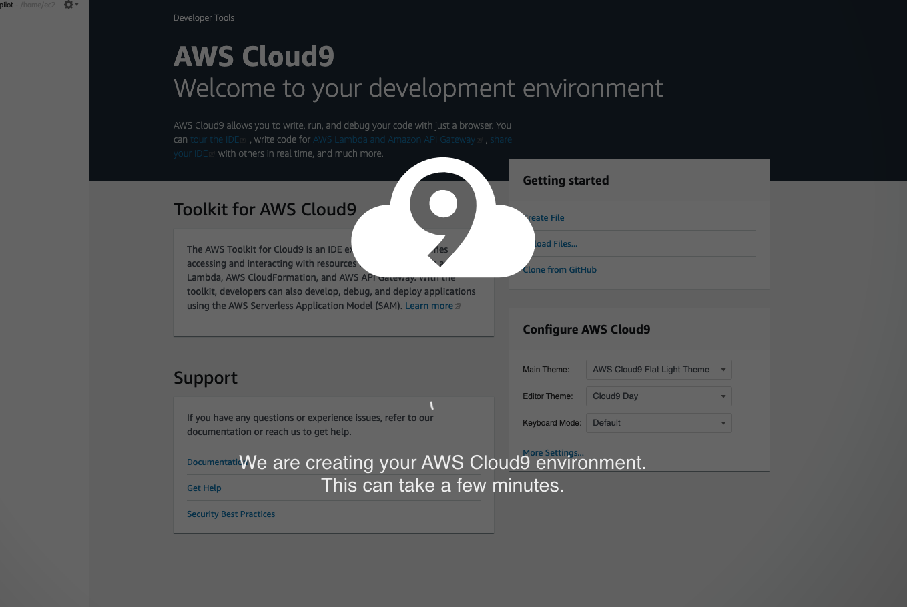
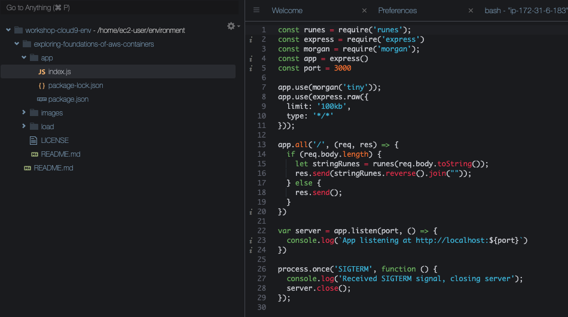

# Deploying a container to AWS Fargate using AWS Copilot

## Step One: Setup a cloud development environment

Log in to your AWS account and open the [AWS Cloud9](https://console.aws.amazon.com/cloud9) console, then click "Create Environment"


Name your environment and click "Next Step"


You can retain the basic default settings for the environment. Just click "Next Step" again:


Now click on "Create Environment"


It will take a couple of minutes to provision and launch the environment:



Once the environment is ready you can click the plus button and select "New Terminal" to open a command line terminal connected to the remote environment:


In the terminal you can now run the command to install the latest version of AWS Copilot, and verify that it runs:

```sh
curl -Lo copilot https://github.com/aws/copilot-cli/releases/latest/download/copilot-linux
chmod +x copilot
sudo mv copilot /usr/local/bin/copilot
copilot --help
```

Last you should clone this repo inside of the environment in order to pull in the code that will be used:

```sh
git clone https://github.com/nathanpeck/deploying-container-to-fargate-using-aws-copilot.git
```

## Step Two: Meet the sample application

In the Cloud9 IDE look at the sidebar and open the file at `/deploying-container-to-fargate-using-aws-copilot/app/index.js`:



This file is the main application code for the sample application that will be deployed. It is a basic Node.js Express microservice that just accepts arbitrary string payloads, and then reverses and returns them.

You can run this microservice locally on the Cloud9 environment even though it is not yet containerized.

Go back to the terminal that you opened in Cloud9 and run:

```sh
cd /deploying-container-to-fargate-using-aws-copilot/app
npm install
node index.js
```

Open a new terminal the same way that you did before and run the following command a few times to send some strings to reverse:

```sh
curl -d "this is a test" localhost:3000
```

If you go back to the other terminal tab where you launched the application you can see logs from the running application.


Press Control + C in that tab to send a quit signal to the application and close it.

## Step Three: Create a Dockerfile for the application

Now that you have seen the application running, it is time to package this application up into a container image that can be run on AWS Fargate.

Create a new file called `Dockerfile` inside of the `app` folder. Copy and paste the following content into the Dockerfile:

```Dockerfile
FROM node:16 AS build
WORKDIR /srv
ADD package.json package-lock.json ./
RUN npm install

FROM node:16-slim
WORKDIR /srv
COPY --from=build /srv .
ADD . .
EXPOSE 3000
CMD ["node", "index.js"]
```

This file defines how to construct a Docker container image for the application. It uses a multistage build. The first stage is run inside a full Node.js development environment that has NPM, and the full package build dependencies, including a compiler for native bindings. The second stage uses a slim Node.js environment that just has the Node runtime. It grabs the prebuilt packages from the previous stage, and it adds the application code.

You can verify that this Dockerfile builds by running:

```sh
docker build -t app .
```

## Step Four: Run the application locally on the Cloud 9 Instance

## Step Five: Use AWS Copilot to build and deploy the application on AWS Fargate

## Step Six: Deploy a load test job using AWS Copilot

## Step Seven: Look at CloudWatch to read the metrics